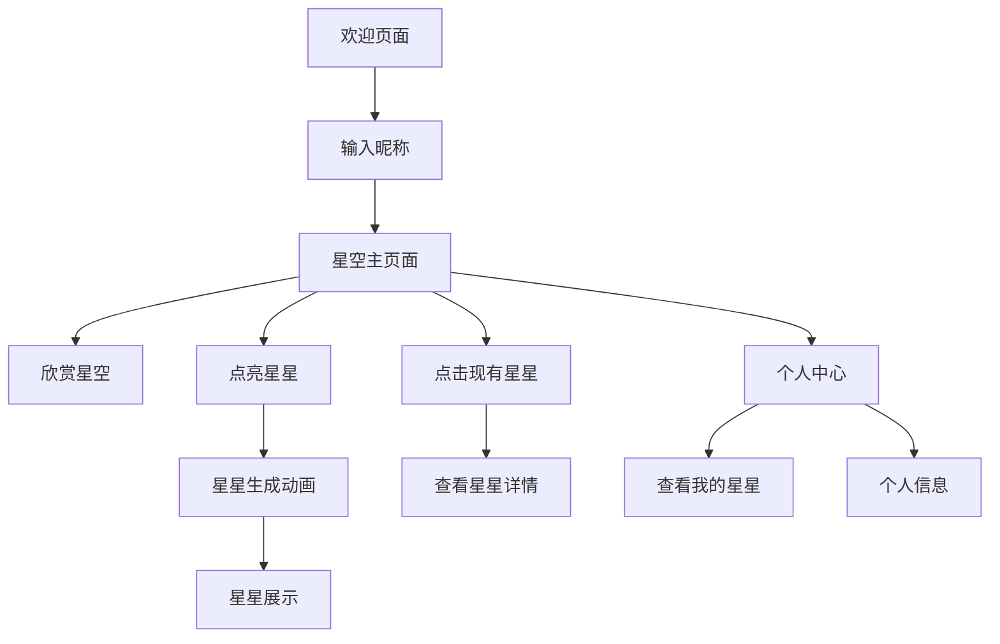

## 1. 产品概述
"宇宙星星"是一款浪漫的互动应用，让用户在虚拟宇宙中留下自己的足迹。用户通过输入昵称，在浩瀚星空中点亮一颗专属星星，记录"到此一游"的美好时刻。产品营造浪漫宇宙氛围，为用户提供情感寄托和社交互动的独特体验。

目标用户：追求浪漫体验的年轻人、喜欢星空和宇宙主题的用户、寻找情感表达方式的人群。
市场价值：满足用户情感表达和纪念需求，创造独特的数字化体验，具有社交分享潜力。

## 2. 核心功能

### 2.1 用户角色
| 角色 | 注册方式 | 核心权限 |
|------|----------|----------|
| 访客用户 | 无需注册，直接输入昵称 | 点亮星星、查看星空 |
| 注册用户 | 邮箱或社交账号注册 | 点亮星星、管理个人星星、查看历史记录 |

### 2.2 功能模块
核心页面包括：
1. **欢迎页面**：应用介绍、昵称输入入口
2. **星空主页面**：星空背景、星星展示、互动操作
3. **个人中心**：我的星星记录、个人信息管理

### 2.3 页面详情
| 页面名称 | 模块名称 | 功能描述 |
|-----------|-------------|-------------|
| 欢迎页面 | 应用介绍 | 展示应用名称、简短描述、美丽的星空背景 |
| 欢迎页面 | 昵称输入 | 输入框用于用户输入别称，支持2-12个字符 |
| 欢迎页面 | 进入按钮 | 点击后进入星空主页面 |
| 星空主页面 | 星空背景 | 动态星空背景，包含闪烁的星星效果 |
| 星空主页面 | 现有星星展示 | 显示所有用户点亮的星星，支持点击查看详情 |
| 星空主页面 | 点亮星星 | 点击按钮在当前位置生成新星星，显示用户昵称 |
| 星空主页面 | 星星动画 | 新星星生成时的闪烁和放大效果 |
| 个人中心 | 我的星星 | 列表显示用户点亮的所有星星记录 |
| 个人中心 | 星星详情 | 显示每颗星星的点亮时间、位置坐标 |
| 个人中心 | 个人信息 | 显示用户昵称、注册时间、星星数量 |

## 3. 核心流程

### 用户流程
1. 用户进入欢迎页面，输入昵称
2. 进入星空主页面，欣赏现有星星
3. 点击"点亮星星"按钮，在随机位置生成新星星
4. 星星生成动画播放，显示用户昵称
5. 用户可以点击任意星星查看点亮信息
6. 注册用户可进入个人中心查看历史记录

## 4. 用户界面设计

### 4.1 设计风格
- **主色调**：深蓝色(#0F1419)作为星空背景，紫色(#6B46C1)和金色(#FFD700)作为星星颜色
- **按钮样式**：圆形发光按钮，带有悬停效果和点击动画
- **字体**：现代无衬线字体，主要文字使用白色，昵称使用金色高亮
- **布局风格**：全屏沉浸式体验，星空作为主体背景
- **图标风格**：线性图标配合发光效果，营造科技感

### 4.2 页面设计概述
| 页面名称 | 模块名称 | UI元素 |
|-----------|-------------|-------------|
| 欢迎页面 | 应用标题 | 大字体应用名称，带有发光效果的星空主题文字 |
| 欢迎页面 | 昵称输入框 | 圆角输入框，带有星星图标，输入时显示发光边框 |
| 欢迎页面 | 进入按钮 | 紫色渐变按钮，悬停时有星星粒子效果 |
| 星空主页面 | 星空背景 | 深色渐变背景，动态闪烁的星星粒子系统 |
| 星空主页面 | 新星星 | 金色发光星星，带有脉冲动画和昵称标签 |
| 星空主页面 | 操作按钮 | 底部悬浮的圆形"点亮星星"按钮，带有旋转动画 |
| 个人中心 | 星星列表 | 卡片式布局，每颗星星显示为缩略图和基本信息 |

### 4.3 响应式设计
- **移动端优先**：针对手机端优化触摸交互
- **自适应布局**：支持不同屏幕尺寸的星空显示
- **触摸优化**：星星点击区域适配手指触摸
- **性能优化**：根据设备性能调整星星粒子数量

## 5. 技术实现要点

### 5.1 前端技术
- 使用Canvas或WebGL渲染星空背景
- CSS动画实现星星闪烁效果
- 响应式设计适配移动端
- 本地存储保存用户昵称（未注册用户）

### 5.2 后端需求
- 用户昵称存储和管理
- 星星位置坐标存储
- 点亮时间记录
- 星星总数统计

### 5.3 数据存储
- 用户信息：昵称、注册时间、星星数量
- 星星数据：位置坐标、点亮时间、用户关联
- 支持数据导出和备份功能

## 6. 扩展功能建议

### 6.1 社交功能
- 星星分享功能（生成分享图片）
- 好友系统，查看好友点亮的星星
- 星星祝福语添加

### 6.2 个性化功能
- 星星颜色选择
- 星座连线功能
- 特殊节日主题星星

### 6.3 统计功能
- 全球星星点亮总数
- 用户活跃度排行
- 特殊成就系统