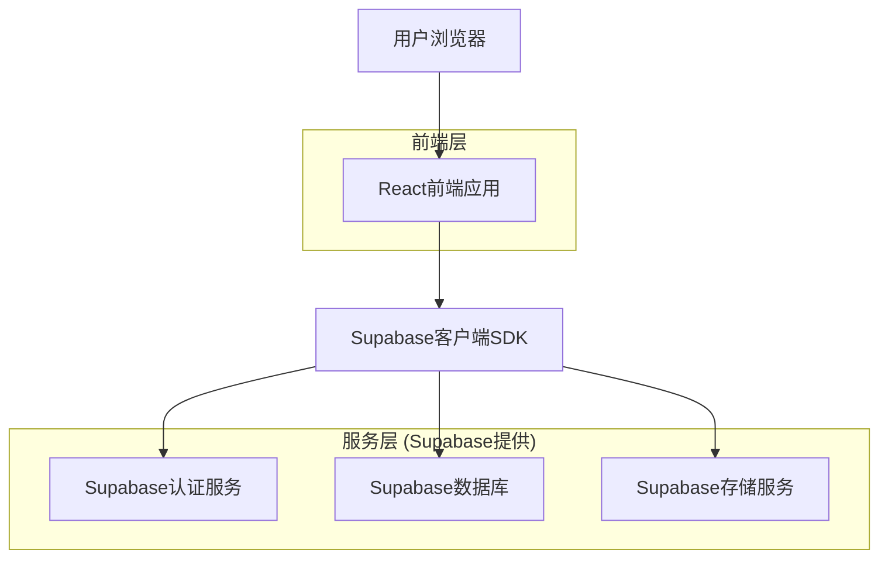
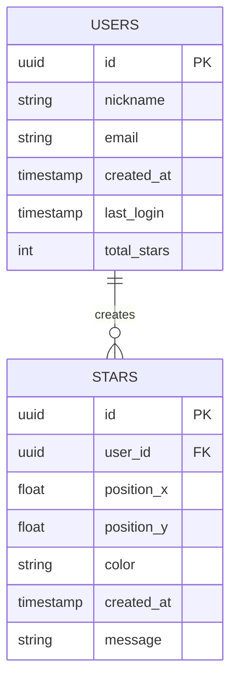

## 1. 架构设计



## 2. 技术描述
- **前端**: React@18 + Three.js@0.158 + TailwindCSS@3 + Vite
- **后端**: Supabase (集成认证、数据库、存储)
- **实时通信**: Supabase Realtime订阅
- **状态管理**: React Context + useReducer

## 3. 路由定义
| 路由 | 用途 |
|-------|---------|
| / | 欢迎页面，应用介绍和昵称输入 |
| /starry-sky | 星空主页面，展示星空和用户星星 |
| /profile | 个人中心，用户星星历史和管理 |
| /star/:id | 星星详情页面，显示特定星星信息 |

## 4. 数据模型

### 4.1 数据库实体关系图


### 4.2 数据定义语言

用户表 (users)
```sql
-- 创建用户表
CREATE TABLE users (
    id UUID PRIMARY KEY DEFAULT gen_random_uuid(),
    nickname VARCHAR(50) NOT NULL UNIQUE,
    email VARCHAR(255) UNIQUE,
    created_at TIMESTAMP WITH TIME ZONE DEFAULT NOW(),
    last_login TIMESTAMP WITH TIME ZONE DEFAULT NOW(),
    total_stars INTEGER DEFAULT 0
);

-- 创建索引
CREATE INDEX idx_users_nickname ON users(nickname);
CREATE INDEX idx_users_created_at ON users(created_at DESC);

-- 授权访问
GRANT SELECT ON users TO anon;
GRANT ALL PRIVILEGES ON users TO authenticated;
```

星星表 (stars)
```sql
-- 创建星星表
CREATE TABLE stars (
    id UUID PRIMARY KEY DEFAULT gen_random_uuid(),
    user_id UUID REFERENCES users(id) ON DELETE CASCADE,
    position_x FLOAT NOT NULL CHECK (position_x >= 0 AND position_x <= 100),
    position_y FLOAT NOT NULL CHECK (position_y >= 0 AND position_y <= 100),
    color VARCHAR(7) DEFAULT '#FFD700',
    created_at TIMESTAMP WITH TIME ZONE DEFAULT NOW(),
    message VARCHAR(200)
);

-- 创建索引
CREATE INDEX idx_stars_user_id ON stars(user_id);
CREATE INDEX idx_stars_created_at ON stars(created_at DESC);
CREATE INDEX idx_stars_position ON stars(position_x, position_y);

-- 授权访问
GRANT SELECT ON stars TO anon;
GRANT ALL PRIVILEGES ON stars TO authenticated;
```

## 5. 前端架构设计

### 5.1 组件结构
```
src/
├── components/
│   ├── Welcome/
│   │   ├── WelcomeScreen.jsx
│   │   ├── NicknameInput.jsx
│   │   └── EnterButton.jsx
│   ├── StarrySky/
│   │   ├── StarryCanvas.jsx
│   │   ├── StarComponent.jsx
│   │   ├── LightUpButton.jsx
│   │   └── StarInfoModal.jsx
│   ├── Profile/
│   │   ├── UserInfo.jsx
│   │   ├── StarHistory.jsx
│   │   └── StarCard.jsx
│   └── Common/
│       ├── LoadingSpinner.jsx
│       └── ErrorBoundary.jsx
├── hooks/
│   ├── useStars.js
│   ├── useUser.js
│   └── useStarryAnimation.js
├── services/
│   ├── supabase.js
│   ├── starService.js
│   └── userService.js
└── utils/
    ├── starPosition.js
    └── animations.js
```

### 5.2 状态管理结构
```javascript
// 全局状态结构
const initialState = {
    user: {
        id: null,
        nickname: '',
        totalStars: 0,
        isAuthenticated: false
    },
    stars: [],
    ui: {
        isLoading: false,
        error: null,
        currentView: 'welcome'
    },
    starrySky: {
        animationSpeed: 1,
        starDensity: 100,
        backgroundTheme: 'deep-space'
    }
};
```

## 6. 核心功能实现

### 6.1 星空渲染系统
```javascript
// 使用Three.js创建3D星空背景
const createStarryBackground = () => {
    const scene = new THREE.Scene();
    const camera = new THREE.PerspectiveCamera(75, window.innerWidth / window.innerHeight, 0.1, 1000);
    const renderer = new THREE.WebGLRenderer({ antialias: true, alpha: true });
    
    // 创建星星粒子系统
    const starsGeometry = new THREE.BufferGeometry();
    const starsMaterial = new THREE.PointsMaterial({ color: 0xFFFFFF, size: 2 });
    
    const starsVertices = [];
    for (let i = 0; i < 10000; i++) {
        const x = (Math.random() - 0.5) * 2000;
        const y = (Math.random() - 0.5) * 2000;
        const z = (Math.random() - 0.5) * 2000;
        starsVertices.push(x, y, z);
    }
    
    starsGeometry.setAttribute('position', new THREE.Float32BufferAttribute(starsVertices, 3));
    const starField = new THREE.Points(starsGeometry, starsMaterial);
    scene.add(starField);
    
    return { scene, camera, renderer, starField };
};
```

### 6.2 用户星星创建
```javascript
// 创建用户星星逻辑
const createUserStar = async (userId, nickname) => {
    const position = generateRandomPosition();
    const starData = {
        user_id: userId,
        position_x: position.x,
        position_y: position.y,
        color: '#FFD700',
        message: `${nickname} 到此一游`
    };
    
    const { data, error } = await supabase
        .from('stars')
        .insert([starData])
        .select()
        .single();
    
    if (error) throw error;
    return data;
};

// 随机位置生成（避免重叠）
const generateRandomPosition = () => {
    return {
        x: Math.random() * 80 + 10, // 10-90% 位置
        y: Math.random() * 80 + 10
    };
};
```

## 7. 性能优化

### 7.1 星空渲染优化
- 使用对象池复用星星对象
- 实现视锥体剔除，只渲染可见星星
- 使用LOD（细节层次）技术，远距离星星使用简化模型
- 添加帧率限制，避免过度渲染

### 7.2 数据加载优化
- 分页加载星星数据，初始加载最近的100颗
- 使用虚拟滚动技术处理大量星星
- 实现数据缓存，避免重复请求
- 使用Supabase Realtime实现增量更新

### 7.3 移动端优化
- 根据设备性能调整星星数量
- 使用CSS动画替代复杂的WebGL效果
- 实现触摸手势优化
- 添加省电模式选项

## 8. 安全考虑

### 8.1 数据安全
- 使用Supabase Row Level Security (RLS) 保护用户数据
- 实现输入验证，防止XSS攻击
- 限制星星创建频率，防止滥用
- 敏感数据加密存储

### 8.2 隐私保护
- 匿名用户可以选择不存储个人信息
- 提供数据导出和删除功能
- 遵守GDPR等隐私法规
- 明确隐私政策和使用条款

## 9. 部署建议

### 9.1 前端部署
- 使用Vercel或Netlify进行静态部署
- 配置CDN加速静态资源
- 实现渐进式Web应用(PWA)功能
- 添加离线访问支持

### 9.2 监控和分析
- 集成错误监控（Sentry）
- 添加用户行为分析（Google Analytics）
- 监控应用性能和加载时间
- 设置告警机制